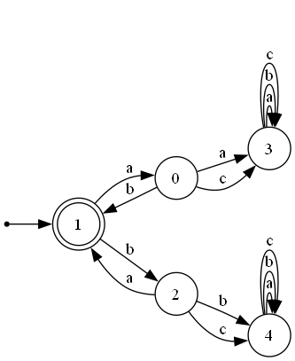
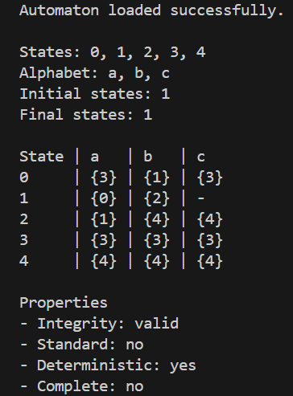

# Automata Toolkit


## Project Overview

Automata Toolkit is a **production-grade CLI tool** designed to parse, validate, and transform finite automata.

Originally built from an academic project, it has been **fully re-engineered into a robust, testable, and extensible software system** following clean architecture principles.

---

## Why this project matters

Most automata projects:
- are theoretical
- lack structure
- are not testable

This project solves that by providing:
✔ a real CLI tool  
✔ strong test coverage  
✔ modular architecture  
✔ real-world engineering practices  

---

## Features

- Parse EFREI automata format
- Determinization (NFA → DFA)
- Completion
- Complement
- Minimization
- Word recognition
- JSON export
- Graphviz export

---

## Architecture

```
src/
  domain/        # core models
  parsers/       # input parsing
  services/      # algorithms
  validators/    # validation rules
  cli/           # entrypoint
```

---

## Usage

```bash
automata-cli --input data/raw/efrei_test_cases/BDX4-01.txt --check-all
```

---

## Example Output

```
Automaton loaded successfully.

Properties:
- Integrity: valid
- Deterministic: yes
- Complete: no
```
---

## Demo

Input → EFREI file  
Output → CLI + Graph




---

## Quality

- 31 unit + integration tests
- 89% coverage
- modular architecture
- CI-ready

---

## Future Improvements

- epsilon transitions
- web UI
- performance optimization
- large-scale automata support

---

## Author

Mathieu Alassoeur  
Data / BI / Analytics Engineering student
